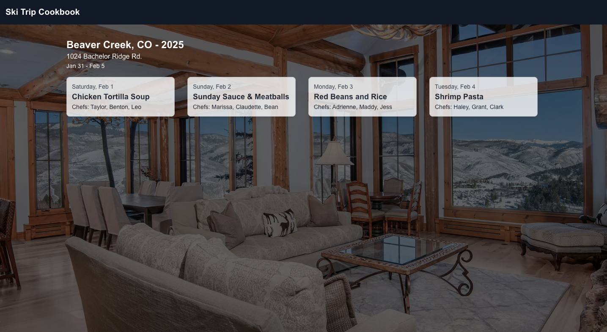
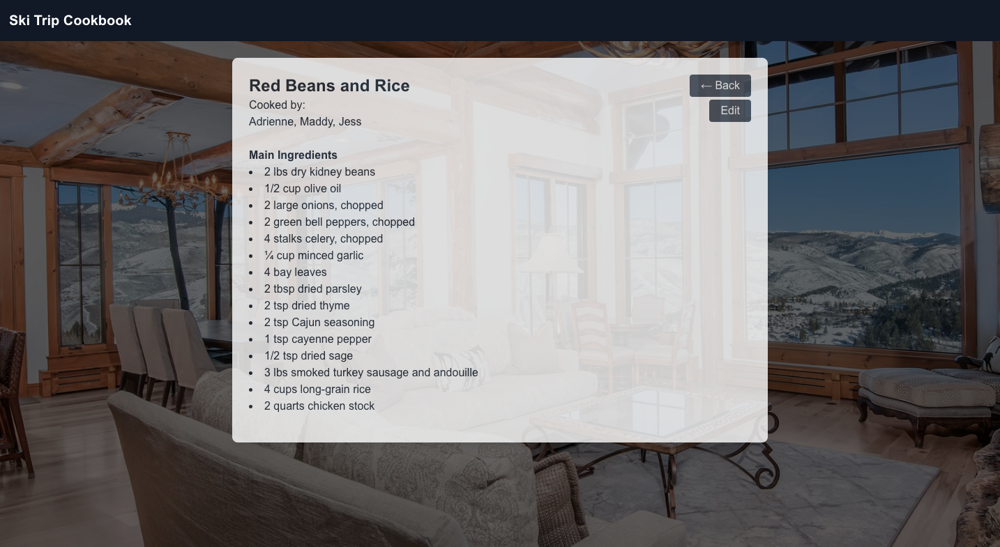

# SkiTripCookbook
## _A digital cookbook for your favorite ski trip meals_

SkiTripCookbook is a collaborative web app designed for skiers to save, organize, and revisit their favorite mountain meals. Whether you're returning to a classic dish from last year's trip or discovering a recipe shared by a friend, this digital cookbook helps preserve the flavors of each ski season.

## Live Demo

You can view a live demo of the app deployed on Vercel by clicking the link below:

[SkiTripCookbook - Live Demo](https://ski-trip-cookbook.vercel.app/)

## Screenshots

**Beaver Creek 2025 Ski Trip View**

**Red Beans and Rice Recipe View**

## Features

- Add, update, and delete your own recipes (stored in Firebase)
- Browse and view recipes shared by other users
- Organize recipes by specific ski trips
- Future update will allow users to create custom trips and assign recipes to each trip

All data is stored and synced using Firebase, enabling persistent access across devices and between trips.

## Tech

SkiTripCookbook is built using:

- Next.js
- Tailwind.css
- Firebase (Firestore database)
- Vercel (Deployment)

## Acknowledgements

SkiTripCookbook is a personal project created to explore collaborative web apps, Firebase integration, and full-stack development with Next.js. All example data and recipes are for demonstration purposes.
